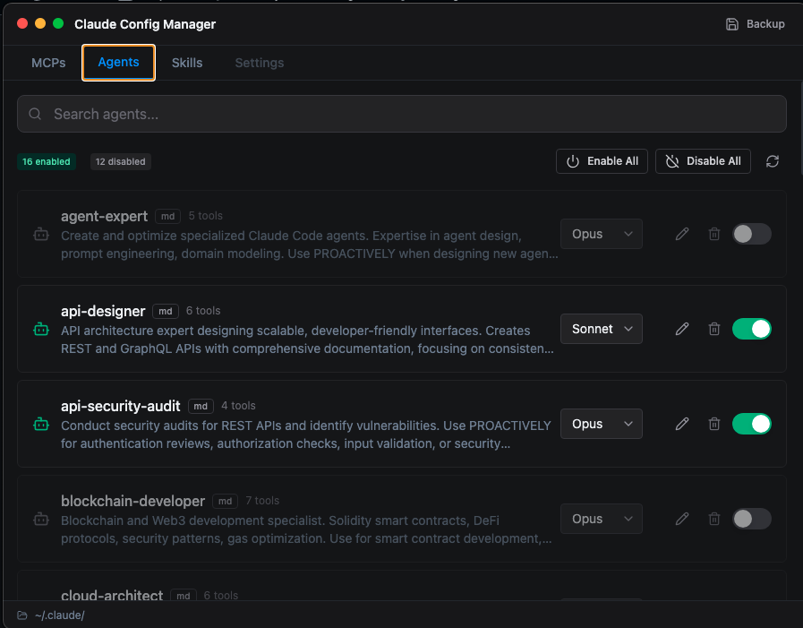

# Claude Config Manager

<div align="center">


</div>

---

> [!CAUTION]
> ## **THIS PROJECT IS HEAVILY OPINIONATED AND WORK-IN-PROGRESS**
>
> **Before you use this, understand:**
>
> 1. **Folder Structure is STRICT** - This app expects Claude Code configs in specific locations (see below). If your setup differs, it won't work correctly.
>
> 2. **NOT Production Ready** - This is alpha software. Bugs will happen. Always have your own backups.
>
> 3. **Modifies Your Claude Configs** - This app reads and writes to `~/.claude.json`, `~/.claude/mcp.json`, and your agents/skills folders. It creates backups, but understand the risk.
>
> 4. **macOS-Focused Development** - Primary testing on macOS. Windows/Linux support is theoretical until tested.
>
> **Use at your own risk. You've been warned.**

---

## What Is This?

An Electron desktop app to **safely manage Claude Code configurations** without risk of corrupting JSON files by hand.

**The Problem:**
- Manually editing `.claude.json` is error-prone (one missing comma = broken config)
- Too many MCPs loaded = bloated context tokens
- No easy way to temporarily disable agents/skills without deleting them
- Claude Code doesn't have a built-in config manager (yet)

**The Solution:**
- Toggle MCPs, Agents, and Skills on/off with one click
- Automatic backups before every change
- "Archive" pattern: disabled items are moved, not deleted
- Monaco-powered JSON editor for when you need raw access

---

## Features

| Feature | Status | Description |
|---------|--------|-------------|
| **MCP Management** | Done | Enable/disable MCP servers from `.claude.json` and `mcp.json` |
| **Agent Management** | Done | Toggle `.md` and `.json` agents in `~/.claude/agents/` |
| **Skill Management** | Done | Toggle skills (directories with `SKILL.md`) |
| **JSON Editor** | Done | Monaco editor with syntax highlighting |
| **Backup System** | Done | Auto-backup before every modification |
| **Search** | Done | Filter items by name |
| **Token Estimation** | Done | Rough token count display |
| **Settings Tab** | Planned | Configure app behavior |
| **Import/Export** | Planned | Share configurations |

---

## Screenshots

<div align="center">

### Agent Management

*Toggle agents on/off, change models, search and filter*

### Built-in Editor

*Monaco-powered editor with syntax highlighting*

</div>

---

## Requirements

> [!IMPORTANT]
> **This app expects a SPECIFIC folder structure.** If your Claude Code setup differs, the app will not find your configs.

### Expected Directory Structure

```
~/ (your home directory)
├── .claude.json                 # Main Claude config (MCPs live here)
└── .claude/                     # Claude's data directory
    ├── mcp.json                 # Additional MCP configs (optional)
    ├── agents/                  # Your custom agents
    │   ├── my-agent.md          # Markdown agent
    │   └── another-agent.json   # JSON agent
    ├── skills/                  # Your custom skills
    │   └── my-skill/            # Skill directory
    │       └── SKILL.md         # Skill definition (required)
    └── .config-manager/         # Created by this app
        ├── backups/             # Automatic backups
        ├── mcp-disabled.json    # Disabled MCPs archive
        ├── agents-disabled/     # Disabled agents archive
        └── skills-disabled/     # Disabled skills archive
```

**Path Resolution:**
- **macOS**: `/Users/<username>/.claude/`
- **Windows**: `C:\Users\<username>\.claude\`
- **Linux**: `/home/<username>/.claude/`

The app uses `os.homedir()` at runtime - **no hardcoded paths**.

---

## Installation

### From Source (Current Method)

```bash
# Clone the repository
git clone https://github.com/YOUR_USERNAME/claude-config-manager.git
cd claude-config-manager

# Install dependencies
npm install

# Run in development mode
npm run dev
```

### Build for Distribution

```bash
# Build and package (creates DMG on macOS)
npm run package

# Output goes to ./release/
```

### Pre-built Releases

Not available yet. Coming when the project is stable.

---

## Usage

### Starting the App

```bash
npm run dev
```

The app will:
1. Detect your home directory
2. Look for `.claude.json` and `.claude/` folder
3. Load all MCPs, agents, and skills
4. Create `.claude/.config-manager/` if it doesn't exist

### Toggling Items

1. Click the toggle switch next to any MCP/Agent/Skill
2. **Disable**: Item is moved to the `-disabled` archive
3. **Enable**: Item is restored from the archive
4. A backup is created before every change

### Editing JSON

1. Click the "Edit" button on any item
2. Monaco editor opens with the current config
3. Edit and save (changes are validated before writing)

### Restoring Backups

1. Go to the Backups tab
2. Select a backup timestamp
3. Click "Restore" to revert to that state

### After Making Changes

> [!WARNING]
> **You must restart Claude Code for changes to take effect!**
>
> Claude Code reads configs at startup. After using this app, restart Claude Code or reload your IDE extension.

---

## Architecture

### Process Model

```
┌─────────────────────────────────────────────────────────────┐
│                    Electron Main Process                     │
│  ┌─────────────┐  ┌─────────────┐  ┌─────────────────────┐  │
│  │   main.ts   │  │  preload.ts │  │  ipc-handlers.ts    │  │
│  │  (window)   │  │  (bridge)   │  │  (file operations)  │  │
│  └─────────────┘  └─────────────┘  └─────────────────────┘  │
└────────────────────────────┬────────────────────────────────┘
                             │ IPC (typed channels)
┌────────────────────────────▼────────────────────────────────┐
│                   React Renderer Process                     │
│  ┌─────────────┐  ┌─────────────┐  ┌─────────────────────┐  │
│  │   App.tsx   │  │  MCPList    │  │  AgentList/SkillList│  │
│  │  (routing)  │  │  (toggle)   │  │  (management)       │  │
│  └─────────────┘  └─────────────┘  └─────────────────────┘  │
└─────────────────────────────────────────────────────────────┘
```

### Key Design Decisions

1. **Archive Pattern**: Disabled items are MOVED, not deleted. You can always restore them.

2. **Atomic Writes**: File writes go to `.tmp` first, then atomic rename. Prevents corruption on crash.

3. **Backup First**: Every modification triggers a backup BEFORE the change.

4. **Context Isolation**: Renderer process cannot access Node.js directly. All file ops go through IPC.

5. **No External Network**: The app never phones home. All operations are local.

---

## Security

### What the App Accesses

| Path | Access | Purpose |
|------|--------|---------|
| `~/.claude.json` | Read/Write | Main MCP configuration |
| `~/.claude/mcp.json` | Read/Write | Additional MCP configs |
| `~/.claude/agents/` | Read/Write | Custom agents |
| `~/.claude/skills/` | Read/Write | Custom skills |
| `~/.claude/.config-manager/` | Read/Write | Backups and disabled item archives |

### What the App Does NOT Do

- No network requests
- No telemetry or analytics
- No credential storage
- No hardcoded paths (uses `os.homedir()`)
- No execution of MCP commands (just config management)

### Electron Security

- `nodeIntegration: false`
- `contextIsolation: true`
- Preload script with typed IPC bridge
- No remote module

---

## Project Structure

```
claude-config-manager/
├── electron/                  # Electron main process (Node.js)
│   ├── main.ts               # Window creation, app lifecycle
│   ├── preload.ts            # IPC bridge (contextBridge)
│   └── ipc-handlers.ts       # File operations, backup logic
│
├── src/                       # React renderer process
│   ├── main.tsx              # React entry point
│   ├── App.tsx               # Tab navigation, state management
│   ├── components/
│   │   ├── MCPList.tsx       # MCP toggle UI
│   │   ├── AgentList.tsx     # Agent management UI
│   │   ├── SkillList.tsx     # Skill management UI
│   │   ├── EditorModal.tsx   # Monaco JSON editor
│   │   └── ui/               # shadcn components
│   ├── lib/
│   │   └── utils.ts          # Formatting utilities
│   └── types/
│       └── electron.d.ts     # TypeScript definitions
│
├── dist-electron/            # Compiled Electron code
├── dist-renderer/            # Compiled React code
├── release/                  # Packaged app output
│
├── .claude/CLAUDE.md         # Project context for AI assistants
└── package.json              # Dependencies and scripts
```

---

## Troubleshooting

### "No configs found"

The app can't find `.claude.json` or `.claude/` in your home directory.

**Fix:** Ensure Claude Code has been run at least once to create these files.

### Changes don't appear in Claude Code

Claude Code reads configs at startup only.

**Fix:** Restart Claude Code or reload your IDE extension.

### "Permission denied" errors

The app can't write to your `.claude/` directory.

**Fix:** Check file permissions: `ls -la ~/.claude/`

### Corrupted config after crash

Check the backups folder: `~/.claude/.config-manager/backups/`

Each backup has a timestamp. Find the most recent good one and restore.

### App shows wrong items

The app caches file state. If you edited files externally:

**Fix:** Restart the app to re-scan all configs.

---

## Development

### Scripts

```bash
npm run dev          # Start dev server + Electron
npm run build        # Build for production
npm run package      # Create distributable (DMG/EXE)
```

### Tech Stack

- **Electron 39** - Desktop app framework
- **React 19** - UI framework
- **TypeScript 5** - Type safety
- **Vite 5** - Build tool
- **Tailwind CSS 3** - Styling
- **shadcn/ui** - Component library
- **Monaco Editor** - JSON editing

### Adding Features

1. Add IPC handler in `electron/ipc-handlers.ts`
2. Expose in `electron/preload.ts`
3. Add types in `src/types/electron.d.ts`
4. Use in React components via `window.electronAPI`

---

## Ask Claude to Help You Set This Up

> [!TIP]
> **Claude Code can help you install and configure this app!**
>
> Just tell Claude:
> ```
> Help me set up Claude Config Manager from https://github.com/rotwurstesser/config-manager
> ```
>
> Claude will:
> 1. Clone the repository
> 2. Install dependencies
> 3. Build and run the app
> 4. Help you understand your current configuration

This works because Claude Code can read the project's documentation and understands how to work with Electron apps.

---

## Future Claude Sessions

> [!NOTE]
> **For Claude Code / AI assistants working on this project:**

### Quick Context

This is an Electron app for managing Claude Code configs. The codebase is well-structured:

- `electron/` = Node.js backend (file I/O)
- `src/` = React frontend (UI)
- IPC bridge connects them via typed channels

### Key Files to Read First

1. `electron/ipc-handlers.ts` - All file operations
2. `src/App.tsx` - Main component and state
3. `src/types/electron.d.ts` - IPC type definitions

### Common Tasks

**Add a new IPC channel:**
1. Handler in `ipc-handlers.ts`
2. Expose in `preload.ts`
3. Type in `electron.d.ts`
4. Call via `window.electronAPI.yourMethod()`

**Add a new UI component:**
1. Create in `src/components/`
2. Use shadcn components from `src/components/ui/`
3. Style with Tailwind classes

**Debug file operations:**
- All writes are atomic (`.tmp` → rename)
- Backups happen BEFORE writes
- Check `.config-manager/backups/` for history

### Known Issues / TODOs

- [ ] Add unit tests for file operations
- [ ] Test on Windows and Linux
- [ ] Add Settings tab for app configuration
- [ ] Add import/export for sharing configs
- [ ] Add file watcher to detect external changes

---

## Contributing

See [CONTRIBUTING.md](CONTRIBUTING.md) for guidelines.

## License

[MIT](LICENSE) - do whatever you want, just don't blame me if it breaks.

---

<div align="center">

**Made for the Claude Code community**

*Because editing JSON by hand is so 2023*

</div>
